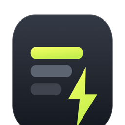

<p align="center">
  
</p>

<h1 align="center">Ramz</h1>

<p align="center">A shelf for the commands you actually use, one keystroke away from anywhere.</p>

<p align="center">
  <a href="LICENSE"></a>
  
  
</p>

Every developer accumulates commands worth keeping: the rebuild incantation with four flags,
the log query with the right filters, the release checklist you half remember. They end up
scattered across a `.zshrc`, a scratch file, and browser history. Ramz keeps them in one
place, makes them searchable from a global palette, and generates real shell aliases for the
handful you type every day.

*Ramz* means symbol, code, or cipher: what you reach for when you cannot remember the
incantation itself.

Five kinds of entry:

| | |
|---|---|
| **Alias** | exported to your shell as a real alias or function |
| **Snippet** | copy only, never exported, and most things belong here |
| **Prompt** | a prompt you hand an agent again and again, with a variant per repo or platform |
| **Runbook** | ordered steps, filled in once and copied as a script or step by step |
| **Note** | reference text: endpoints, hosts, values you look up rather than run |

Everything is local. No account, no sync, no network.

## About this project

A side project, and an experiment in how far vibe coding goes. Every line of it was written
by Claude: the app, the shell generator, the build and release scripts, these docs, and the
icon. I directed, reviewed and decided; I did not type the code.

Worth knowing before you rely on it:

- There is no test suite yet. It is verified by running it, by booting the packaged app
  against the real store, and by executing the generated shell files in bash and zsh.
- Builds are unsigned, so macOS will warn you. See [docs/install.md](docs/install.md).
- It writes in exactly two places, `~/.config/ramz` and `~/.local/share/ramz`, plus one
  tagged line in your shell rc that you add yourself. Deleting those removes it completely.

If you are an AI agent picking this up, start with [docs/agents.md](docs/agents.md).

## Install

macOS, Apple silicon:

```sh
curl -fsSL https://raw.githubusercontent.com/mrehan27/Ramz/main/install.sh | sh
```

That downloads the latest [release](https://github.com/mrehan27/Ramz/releases), installs it
to `/Applications` and opens it. The build is unsigned, so the script clears the quarantine
flag macOS puts on downloads. To do it by hand, or to update or uninstall, see
[docs/install.md](docs/install.md).

## Use

Ramz lives in the menubar. Click the icon, or:

| | |
|---|---|
| **⌘⇧K** | the palette, over whatever you are doing |
| **⌘⇧M** | the main window, to add and edit entries |
| **⌘K** | the palette, inside the app |
| **⌘,** | Settings |

Type a few letters, press Enter, and the command is on your clipboard. Commands with
`{{arguments}}` ask for values first and remember what you typed.

Aliases are the only kind that touch your machine, and only when you press Sync to shell. That
writes two files into `~/.config/ramz` and adds one tagged line to your shell rc. Deleting
that directory removes Ramz from your shell completely; nothing else is touched.

## Docs

| | |
|---|---|
| [install.md](docs/install.md) | installing by hand, updating, uninstalling |
| [using.md](docs/using.md) | the UI in detail: arguments, runbooks, tags, import and export |
| [development.md](docs/development.md) | running from source, the scripts, packaging and releases |
| [architecture.md](docs/architecture.md) | how it is put together, and why |
| [agents.md](docs/agents.md) | conventions for AI agents working on this repo |
| [notes.md](docs/notes.md) | decisions, traps already hit, open threads |

## Licence

MIT, see [LICENSE](LICENSE).

---

<p align="center">
  <sub>Written by <a href="https://claude.com/claude-code">Claude</a>, directed and reviewed by
  <a href="https://github.com/mrehan27">@mrehan27</a>.</sub>
</p>
